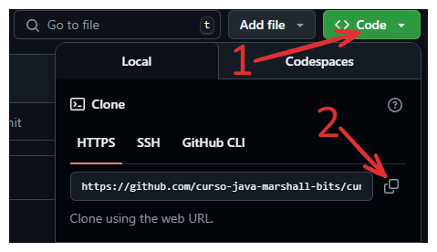
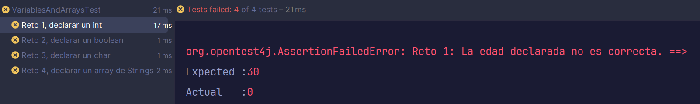
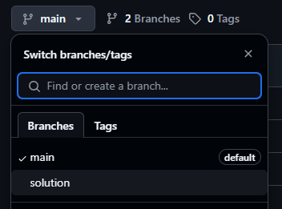

# RetoBit: Numbers and operations 👩‍🔬

En este RetoBit, vamos a trabajar con números. Haremos alguna que otra operación básica, casting, y usaremos el Math. 
Estos ejercicios son útiles también para practicar el uso de git, testing y pull requests. Herramientas esenciales en un entorno de trabajo. 

## Fork del repositorio:

Haz un fork del repo.

Pulsa el botón Fork en github:


Esto creará una copia del repositorio en tu perfil de Github. 

## Clona el repo en tu computadora

Ahora hay que descargarse el proyecto en tu computadora.

### 1. Asegúrate de que estás en la URL de TU copia del repositorio
   

Si la URL es esta: https://github.com/curso-java-marshall-bits/retobit-NumbersAdnOperations **NO ES CORRECTO**.
    

Donde aparece 'curso-java-marshall-bits' debería aparecer tu nombre de usuario. Haz click en tu perfil y mira tus repositorios para comprobar si hiciste el fork. En caso contrario vuelve al paso anterior. 


### 2. Pulsa en "code" para ver la URL del repositorio y cópiala



Para ello deberás abrir una terminal y navegar a la carpeta donde quieras añadir este retobit.

Utiliza el siguiente comando:

```commandline
git clone https://aqui.debes.pegar.la.url
```

**Nota: Después del 'git clone' debes pegar la url del repositorio. No pongas la que he puesto yo en el ejemplo 🤣*

Ahora se va a crear un nuevo directorio con el nombre del retobit.

### 3. ¡Ya puedes abrir este reto en IntelliJ!

# Instrucciones

Este reto consiste en hacer varias operaciones y trabajar con datos numéricos básicos. Abre el archivo *NumbersAndOperations* que está ubicado dentro de **src/main/java**. Allí tienes una serie de métodos con las instrucciones encima para cada uno de los retos.

En el caso de que quieras realizar pruebas puedes hacerlo al final del archivo en el método **main**:

````java
public static void main(String[] args) {
    // Puedes hacer pruebas por aquí 🤖
}
````

## Testing

Para comprobar si has realizado bien el ejercicio ejecuta los tests ubicados en **src/test**. Pulsa con el botón derecho en el archivo *NumbersAndOperationsTest* y selecciona la opción *Run NumbersAndOperationsTest* 

El test te indicará si has pasado con un tick verde ✅. En caso contrario verás el error.

Ejemplo:



Pulsa en cualquiera de los tests que has fallado y mira el mensaje de la derecha.

- *Expected*: es el valor que el test estaba esperando.
- *Actual*: es el valor que tu reto está retornando. 

## Solución

Si quieres ver una posible solución para el retobit que pasa todos los tests puedes mirar la rama *solution* dentro del repositorio.



Ten en cuenta que hay muchas formas de resolver los ejercicios y la tuya puede pasar los tests iguales, pero ser completamente distinta a la solución. No significa que la tuya esté mal. Compara los resultados y decide cuál te gusta más o te parece mas legible.

## Entrega

Realiza un commit con los cambios desde la terminal:

1. Añade todos los cambios
````commandline
git add .
````

2. Haz el commit con el mensaje
````commandline
git commit -m "retobit finalizado"
````

3. Haz un push
````commandline
git push origin main
````

Debes realizar una pull request para entregar el ejercicio. Abre el link del repositorio en github y haz click en la pestaña *pull requests*.

Selecciona *New pull request*, *Create pull request* y confírmala. Esto hará que yo pueda verlo y revisarlo en caso de que haya fallado algún test para poder darte feedback.

Mucha suerte con el reto. Te mando un abrazo y ¡Sigamos desarrollando! 🫂

[marshall-bits.dev](http://marshall-bits.dev)

*Nota: Estos retos pertenecen al curso de Marcel Bosch de Java para desarrolladores junior. Cualquier uso fuera de este contexto debe estar autorizado explícitamente. Si quieres usar estos ejercicios ponte en contacto conmigo a través de mis redes sociales (visita mi página para [más información](http://marshall-bits.dev)).* 